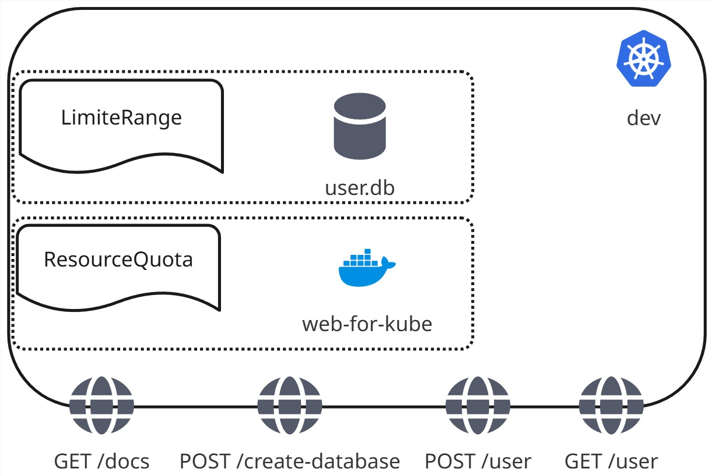
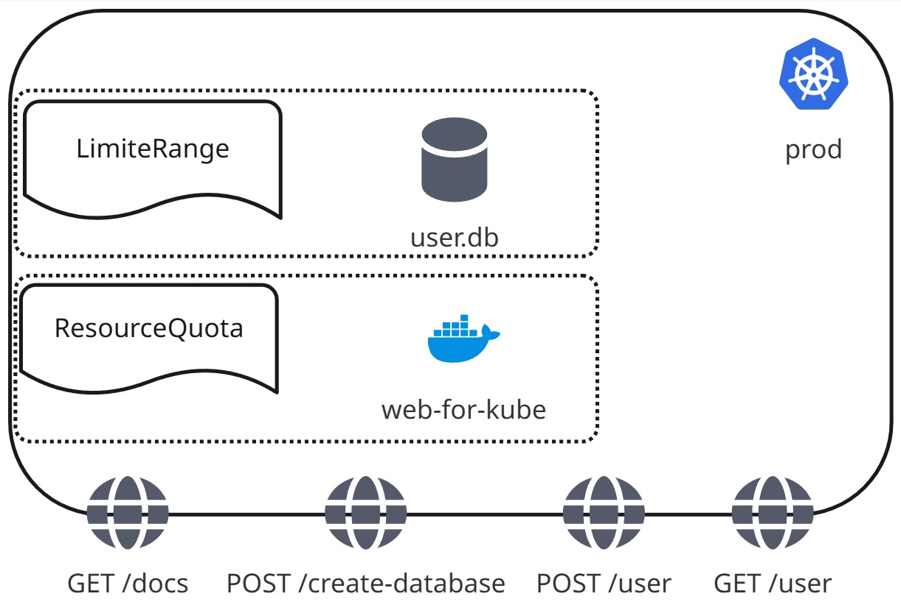
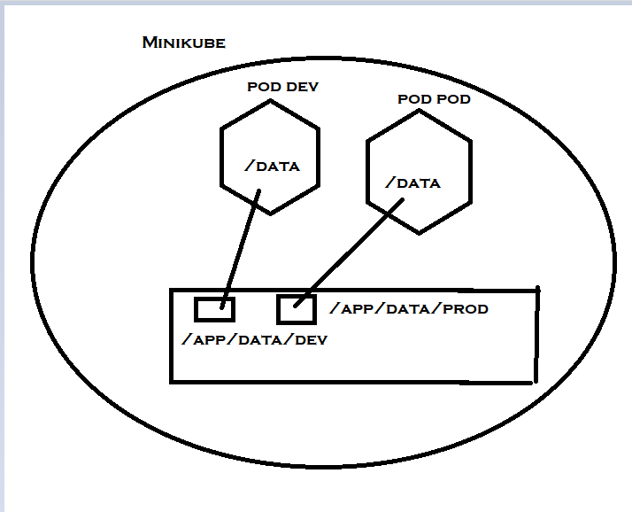

# web-for-kube

# Architecture
## Dev

## Prod

## Volume

# Commands
## Namespace
```
kubectl create namespace prod 
kubectl create namespace dev
```
## image build
```
cd src
docker build -t web-for-kube .
```
## helm deployment
```
minikube image load web-for-kube
cd ../web-for-kube
helm install web-for-kube . -n dev -f values-dev.yaml
helm install web-for-kube . -n prod -f values-prod.yaml
minikube service web-for-kube -n dev --url
minikube service web-for-kube -n prod --url
```
## helm uninstall
```
helm uninstall web-for-kube -n dev
helm uninstall web-for-kube -n prod
```
## helm supervisor
```
kubectl get all -n dev
kubectl get all -n prod
kubectl get events -n dev --sort-by=.lastTimestamp
kubectl get events -n prod --sort-by=.lastTimestamp
```
# Test
- Lancer les commandes Namespace, image build et helm deployment
- Vérifier avec les commande helm supervisor que tout s'est bien lancé correctement
- Aller sur /docs de l'url donné par la commande "minikube service web-for-kube -n dev --url" pour accéder au swagger de l'application (la commande bloque la console, pour essayer les deux environnements en même temps, utiliser une deuxième console pour lancer pour le deuxième environnement)
- Tester les routes avec le swagger
# Values
- volume
- volumeMounts
- ressources
- namespace
- requests
- limits
- datapath